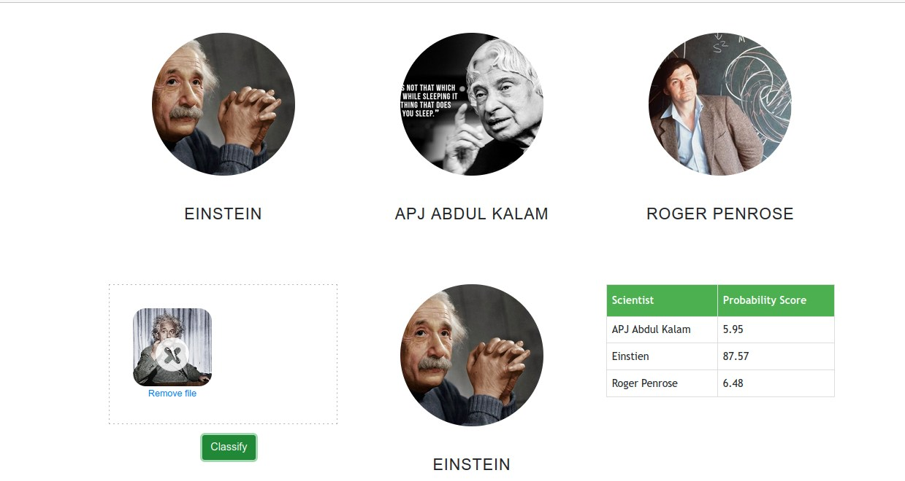

In this data science and machine learning project, we classify science personalities. We restrict classification to only 3 people,
1) Einstein
2) APJ Abdul Kalam
3) Roger Penrose

Here is the folder structure,
* UI : This contains ui website code 
* server: Python flask server
* model: Contains python notebook for model building
* model>dataset: Dataset used for our model training

Technologies used in this project,
1. Python
2. Numpy and OpenCV for data cleaning
3. Matplotlib & Seaborn for data visualization
4. Sklearn for model building
5. Jupyter notebook, visual studio code and pycharm as IDE
6. Python flask for http server
7. HTML/CSS/Javascript for UI

